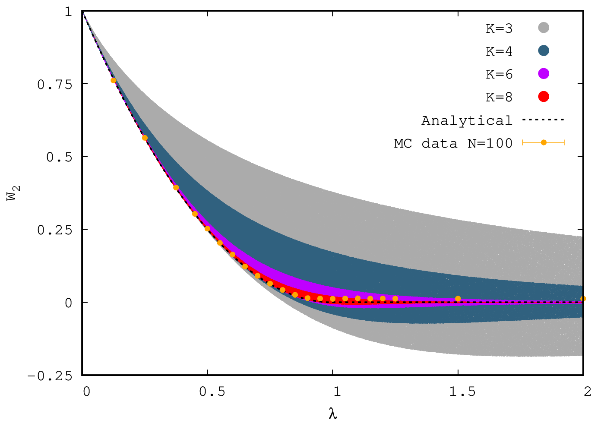

# bootstrap-gww
Bootstrap code for GWW model, which works on positivity matrix defined in **arXiv: 1612.08140**

Other papers which will help to understand this code is **arXiv: 2108.08757** and **arXiv: 2109.08033**

> Run using _" bash run\_script "_

Control size of positivity matrix by changing **N** in code, where N = K + 1, where K is highest power of operator in matrix

The positivity of matrix is checked by checking how eigenvalues are behaving with the help of _LAPACK_ 

> Run time of code for say 1 million sweeps is less than 10 seconds for K = 6

Any suggestions : Write to me navdeep.s.dhindsa@gmail.com 

Next step is to improve it by trying other form of positivity matrix

Result for Wilson loop and and second winding: 

**W vs $\lambda$**

 

**$W_2$ vs $\lambda$**

**$W_3$ vs $\lambda$**

**$W_4$ vs $\lambda$**

